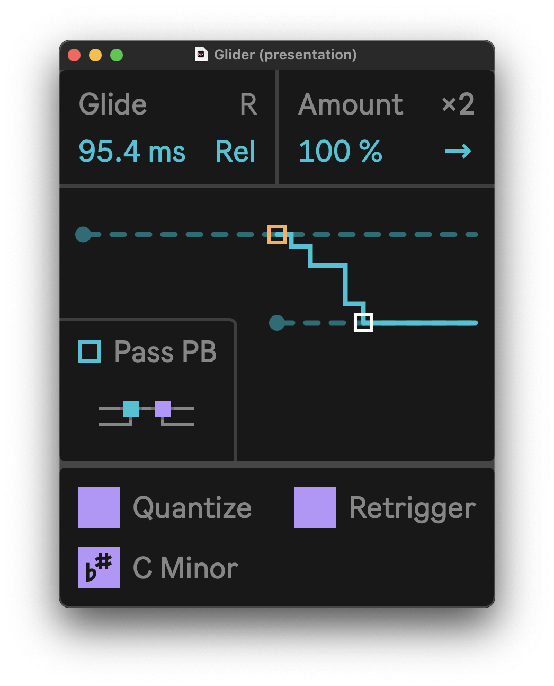

# Glider

Flexible MPE portamento effect for Ableton Live 12.



Glider generates MPE pitch-bend automations that mimic various pitch effects:
- portamento, glissando, legato playing
- analog oscillator drift, extreme detuning, chords mutation
- arpeggios, resonators, note delays
- and much more — imagination is your limit, Glider rewards exploration and messing around.

Additionally, you can chain multiple Gliders together for infinitely complex effects and interactions.

## Setup

```shell
git clone --recursive https://github.com/pema4/lerpmusic-glider
```

Additionally you can install dev tooling:
```shell
git config --local diff.maxpat.textconv "python3 maxdevtools/maxdiff/maxpat_textconv.py"
git config --local diff.amxd.textconv "python3 maxdevtools/maxdiff/amxd_textconv.py"
git config --local diff.amxd.binary true
git config --local diff.als.textconv "python3 maxdevtools/maxdiff/als_textconv.py"
git config --local diff.als.binary true
```

Currently, Glider requires Max 9 to run.

## Architecture

There are 15 per-voice pitch-bend envelopes and one global envelope.

The global envelope follows the pitch of the last pressed note (incoming note-on messages form a stack). The target of this envelope is updated on every note-on and note-off MIDI message.

Each per-voice envelope starts when the device receives a note-on message. This envelope begins from the pitch value of the global envelope and converges to zero over a specified duration.

Glider is designed for combining and chaining. In this case, a naive implementation using the standard Max line object results in O(N^2) time complexity (where N is the number of chained Glider devices). To overcome this, we implemented a custom demand-rate variant of the line object. When the rate of incoming pitch-bend messages is high enough, the internal metronome turns off.

## Timing

Processing is synchronous: glide is computed and emitted in the same event as the incoming MIDI message (note on/off and pitch-bend). Theoretically, this means that the generated pitch-bend is consistent even for short notes.

Additional MIDI messages are generated by the internal metronome, and it is not that accurate. This MIDI jitter is barely hearable, unless 'Quantize Retrigger' is enabled — that way generated notes may have (barely noticeable) length variations.

## Routing

Glider can process an incoming pitch-bend in two ways:
- by default, incoming pitch-bend is used to drive the global envelope — this way Glider can correctly process MIDI notes generated by another Glider in 'Quantize Retrigger' mode. Incoming pitch-bend quantized with the generated glide.
- with 'Bypass Input' enabled, Glider does not process incoming pitch-bend, and just outputs it back at the end of the processing chain.
